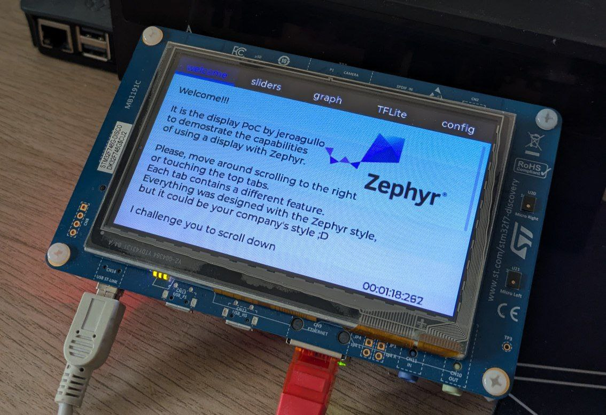

 
 
  

This project is a comprehensive demonstration of various capabilities available within the Zephyr RTOS ecosystem. It showcases a rich user interface built with LVGL, real-time sensor data visualization, machine learning inference with TensorFlow Lite, and IoT connectivity via MQTT.



# ✨ Features
The demo uses the `LVGL` library to create different tabs providing the following features:
- **Boot-up Window:** A splash screen shown on device startup.
- **LVGL User Interface:** A responsive, tab-based UI for navigating different features.
- **Real-time Data Graphing:** Visualizes Inertial Measurement Unit (IMU) sensor data on a live chart.
- **IoT Connectivity:** 
  - **Network:** Establishes a network connection (Ethernet).
  - **MQTT:** Sends and receives data (e.g., from UI sliders) to and from an MQTT broker.
- **Machine Learning:** Performs gesture recognition using a TensorFlow Lite model that takes IMU data as input.
- **Device Configuration:** A dedicated tab to display system and network configuration.

# 🎯 Setup Zephyr Environment
First, ensure you have a working Zephyr development environment. If you don't, please follow the official [Zephyr Getting Started Guide](https://docs.zephyrproject.org/latest/getting_started/index.html).

- **Zephyr version:** 3.7.1 (latest LTS version)
- **Zephyr SDK:** v0.16.8

Make sure you are using the correct Zephyr version for this project:

```shell
# Navigate to your Zephyr installation
cd zephyrproject

# Checkout the correct branch and update dependencies
git switch v3.7-branch
west update
```

- **hash commit:** c291ed46f915cb72aef28479c709356f18f37462 (24 January 2025)
- **Tested boards:**
  - stm32f746g_disco

## 🛠️ Build
```
# From the project's root directory
west build -b stm32f746g_disco
```

## ⚡️ Flash
```
west flash
```

# 🔧 Project Structure

```
display-poc-1_jero/
├── CMakeLists.txt      # Main CMake build script
├── prj.conf            # Kconfig project configuration
├── README.md           # This file
└── src/
    ├── main.c              # Main application entry point and thread setup
    ├── config.h            # Project-wide configuration (MQTT, etc.)
    ├── config_network.c    # Network initialization logic
    ├── config_network.h
    ├── jeroagullo_lvgl/    # LVGL UI source files
    |   ├── jeroagullo_tabs.c   # UI tabs implementation
    |   ├── jeroagullo_charts.c # Charting logic for sensor data
    |   ├── jeroagullo_styles.c # Custom LVGL styles
    |   └── ...
    └── mqtt
        ├── jeroagullo_mqtt.c
        └── jeroagullo_mqtt.h
```

Here's the README.md section for your MQTT configuration:

# 🔧 MQTT Configuration

The project uses Zephyr's Kconfig system for flexible MQTT configuration. All MQTT settings can be customized without modifying source code.

## 📋 Configuration Options

The following MQTT parameters are configurable via Kconfig:

| Setting | Kconfig Variable | Default Value | Description |
|---------|------------------|---------------|-------------|
| **Client ID** | `CONFIG_MQTT_CLIENTID` | `"my-client"` | Unique identifier for this MQTT client |
| **Broker Address** | `CONFIG_MQTT_SERVER_ADDR` | `"10.42.0.1"` | IP address or hostname of MQTT broker |
| **Broker Port** | `CONFIG_MQTT_SERVER_PORT` | `1883` | MQTT broker port (typically 1883) |
| **Topic** | `CONFIG_MQTT_TOPIC` | `"telemetry"` | Default topic for publishing data |
| **Authentication** | `CONFIG_MQTT_USE_AUTH` | `y` | Enable/disable username/password auth |
| **Username** | `CONFIG_MQTT_USER_NAME` | `"my-auth-id-1@my-tenant"` | MQTT authentication username |
| **Password** | `CONFIG_MQTT_PASSWORD` | `"my-password"` | MQTT authentication password |

### ⚙️ Configuration Methods

#### Method 1: Edit `prj.conf` (Recommended for Development)
```conf
# MQTT Configuration
CONFIG_MQTT_CLIENTID="stm32-sensor-01"
CONFIG_MQTT_SERVER_ADDR="10.42.0.1"
CONFIG_MQTT_SERVER_PORT=1883
CONFIG_MQTT_TOPIC="sensor-data"
CONFIG_MQTT_USE_AUTH=y
CONFIG_MQTT_USER_NAME="device-user"
CONFIG_MQTT_PASSWORD="secure-password"
```

#### Method 2: Interactive Menuconfig
```bash
west build -t menuconfig
```
Navigate to: **MQTT Configuration** → Modify settings → Save

#### Method 3: Command Line Override
```bash
west build -- -DCONFIG_MQTT_SERVER_ADDR=\"192.168.1.100\" -DCONFIG_MQTT_CLIENTID=\"custom-client\"
```

### 🔐 Authentication Handling

- When `CONFIG_MQTT_USE_AUTH=n`: No credentials sent to broker
- When `CONFIG_MQTT_USE_AUTH=y`: Username/password sent if provided
- Empty username/password strings are treated as no authentication

## 🧪 Testing with Mosquitto

For local testing and development, we provide a complete Mosquitto MQTT broker setup. 

**📖 See detailed Mosquitto setup instructions here:** [mosquitto/README.md](mosquitto/README.md)


## 🚨 Troubleshooting

- **Connection refused**: Verify Mosquitto is running and firewall allows port 1883
- **Authentication failed**: Check username/password in Mosquitto configuration
- **Network unreachable**: Ensure STM32 and PC are on same network subnet

For advanced Mosquitto configuration, security settings, and Docker deployment options, refer to the complete [mosquitto/README.md](mosquitto/README.md).
# 📅 TODO list
- [x] Add basic interface in LVGL with styles
- [x] disable/enable the threads when a tab is pressed
- [x] Add mutex to all lvgl functions to synchronize with lv_task_handler() call
- [x] Add Network connection (tested with ethernet)
- [x] Add sliders to corresponding windows
- [x] Add mqtt to send the sliders values
- [ ] Add IMU sensor
- [ ] Add TensorFlow Lite model


# 🌟 How to Contribute
Star the repo if it helps you! ⭐

Open an Issue for questions or suggestions. Submit a Pull Request to add new features.